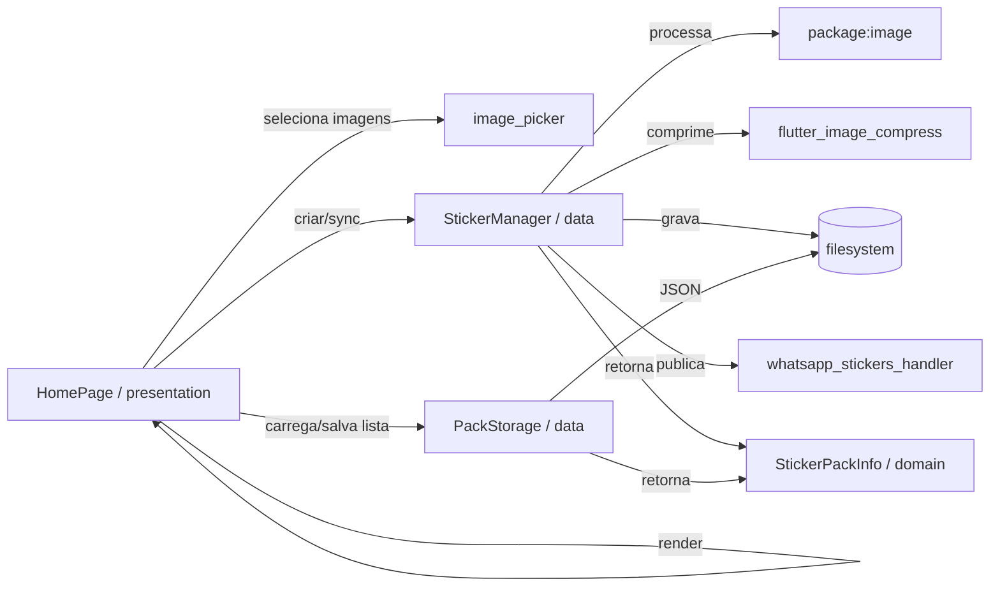

# Project Blueprint (reutilizável)

Este arquivo serve como **template** para reaproveitar arquitetura + decisões técnicas + design do sistema em outros projetos Flutter.

## 1) Linguagem, SDK e plataforma

- **Linguagem:** Dart
- **SDK (pubspec):** `sdk: ^3.11.3`
- **Framework:** Flutter (Material)
- **Plataformas:** Android/iOS/Web/Desktop (estrutura padrão do Flutter)

## 2) Stack (dependências relevantes)

Definidas em `pubspec.yaml`:

- `http`: chamadas HTTP
- `image`: processamento de imagem (resize/crop/encode)
- `image_picker`: seleção de imagens no dispositivo
- `flutter_image_compress`: compressão/geração WebP
- `path_provider`: diretórios do app (Documents/Support)
- `whatsapp_stickers_handler`: integração com WhatsApp Stickers

### Estado / Gerenciamento de estado

- **MobX:** **não utilizado** neste projeto.
- **Padrão atual:** `StatefulWidget` + `setState` + métodos assíncronos.

Observação: para projetos grandes, você pode plugar MobX/Riverpod/BLoC depois, mas aqui a arquitetura foi montada para funcionar bem sem dependência extra.

## 3) Arquitetura de pastas (feature-first)

Referência: `lib/src/`.

```
lib/
  main.dart                 # bootstrap
  src/
    app/                     # raiz: MaterialApp, tema, rotas
      app.dart
      theme/
        app_theme.dart

    features/                # features isoladas
      <feature>/
        domain/              # modelos/regras puras
        data/                # IO, storage, plugins, rede
        presentation/        # telas/widgets e estado

    shared/                  # reutilizável entre features
      widgets/
```

### Feature existente: Stickers

```
lib/src/features/stickers/
  domain/
    sticker_pack_info.dart
  data/
    pack_storage.dart
    sticker_manager.dart
  presentation/
    home_page.dart
    widgets/
      home_floating_button.dart
```

## 4) Regras de dependência (simples e escalável)

- `presentation` pode importar `domain` e `data`
- `data` pode importar `domain`
- `domain` idealmente não depende de Flutter/IO/plugins
- `app` só orquestra (não concentra regra de negócio)

## 5) Design do sistema (visão macro)

### 5.1 Componentes

- **App root**: `StickerApp` (MaterialApp + tema + página inicial)
- **Feature UI**: `HomePage` (tabs + ações do usuário)
- **Serviço de stickers**: `StickerManager` (criar/salvar/sincronizar com WhatsApp)
- **Persistência**: `PackStorage` (lista de pacotes em JSON)

### 5.2 Fluxo de dados (alto nível)

1) Usuário seleciona imagens (UI)
2) `StickerManager` converte para WebP, grava arquivos no disco e gera `contents.json`
3) `WhatsappStickersHandler` tenta publicar/atualizar o pack
4) `PackStorage` persiste a lista de packs e flags (`published`, `needsSync`)



## 6) Decisões de UI (design system)

- **Material 3** ativo (`useMaterial3: true`).
- **Tema escuro** baseado em `ColorScheme.fromSeed`.
- **Tema fica centralizado** em `lib/src/app/theme/app_theme.dart`.
- Componentes compartilhados ficam em `lib/src/shared/` (ex.: `BaseAppBar`).

Boas práticas de design para reuso:
- não espalhar `ThemeData` por telas
- preferir `Theme.of(context)` + `colorScheme`

## 7) Storage e formato de dados

### 7.1 Onde os dados ficam

- Lista de packs: `ApplicationSupportDirectory` (arquivo `sticker_packs.json`)
- Arquivos de stickers: `ApplicationDocumentsDirectory` em `stickers/<packId>/`

### 7.2 Compatibilidade / migração

- O `StickerManager` tenta migrar stickers “legados” do diretório antigo quando necessário.

## 8) Padrões de código (convenções)

- Pastas: `snake_case`
- Classes: `PascalCase`
- Métodos/variáveis: `camelCase`
- UI strings: atualmente em pt-BR (consistente com o app)

Sugestão para projetos reutilizáveis:
- crie um arquivo `src/shared/i18n/` ou use `flutter_localizations` quando escalar (não incluso aqui)

## 9) Testes

- Teste de widget aponta pro root: `StickerApp`.
- `StickerApp(loadHomePacks: false)` evita inicializar plugins no `initState` durante testes.

## 10) Como copiar para outro projeto (checklist)

1) Copie `lib/src/`.
2) Ajuste `lib/main.dart` para `runApp(const <SeuApp>());`.
3) Renomeie o feature folder `features/stickers` para a(s) sua(s) feature(s).
4) Em `src/app/app.dart`, troque `home:` para sua página inicial.
5) Rode `flutter test` e depois `flutter run`.

## 11) Evoluções recomendadas (quando o app crescer)

Sem mudar a estrutura geral:

- **DI (injeção)**: trocar classes estáticas por interfaces + implementação (ex.: `StickerRepository`).
- **Estado global**: se precisar, introduzir um gerenciador (MobX/Riverpod/BLoC) por feature.
- **Camada de erros**: padronizar `Result`/`Either` e mensagens pro usuário.

> Importante: este blueprint mantém o mínimo de complexidade para ser fácil de reaproveitar.
